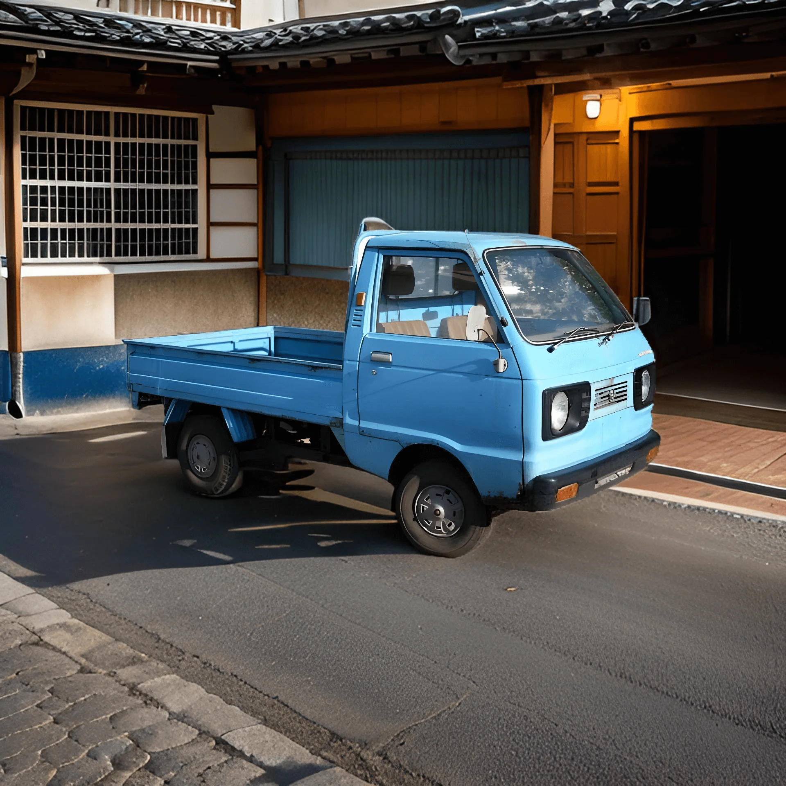
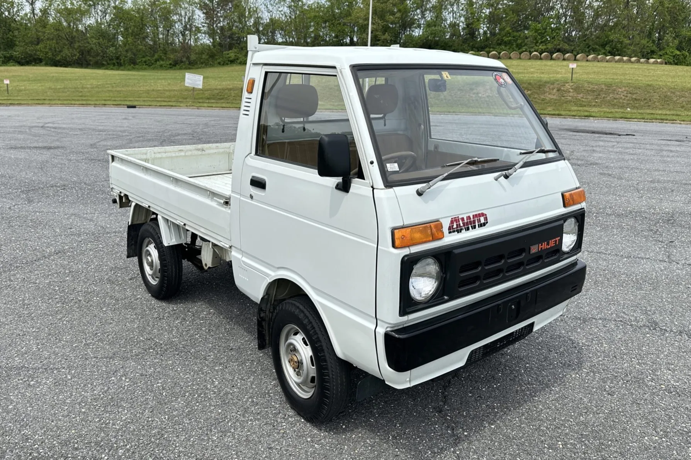
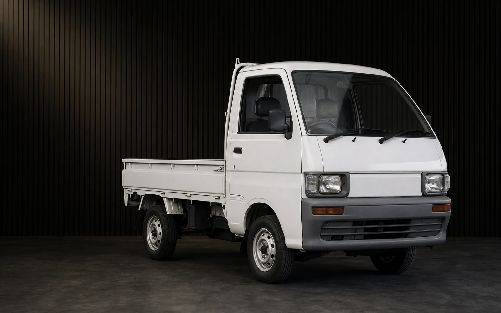
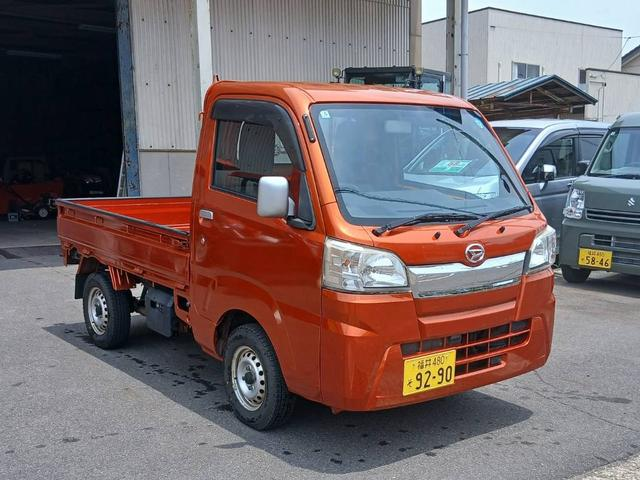

Earlier pickups were sold as the Hijet 55 Wide Pick or Hijet Pick; the Hijet Truck name was adopted in 1999.

# 5th Generation

## S60P

* **Production:** 1977-1981
* **Engine:** AB 547cc SOHC I2, carburettor (28 PS)
* **Drivetrain:** RWD
* **Transmission:** 4-speed manual
* **Notes:** First 550cc Hijet, sold as the Hijet 55 Wide Pick.

# 6th Generation

## S65P / S66P

* **Production:** 1981-1986
* **Engine:** AB 547cc SOHC I2, carburettor (29 PS)
* **Drivetrain:** RWD (S65P); selectable part-time 4WD (S66P, from 1982)
* **Transmission:** 4/5-speed manual
* **Notes:** Climber agricultural 4WD arrived in 1982; the Jumbo extended cab followed in 1983. Front disc brakes were fitted to selected 4WD grades.

# 7th Generation

## S80P / S81P - 550cc

* **Production:** 1986-1990
* **Engine:** EB 547cc SOHC I3, carburettor (30 PS); supercharged (44 PS)
* **Drivetrain:** RWD (S80P); selectable part-time 4WD (S81P)
* **Transmission:** 4/5-speed manual
* **Notes:** First three-cylinder Hijet. Climber 4WD grades offered Super Diff Lock.

## S82P / S83P - 660cc

* **Production:** 1990-1994
* **Engine:** EF 659cc SOHC I3, carburettor (38-42 PS)
* **Drivetrain:** RWD (S82P); selectable part-time 4WD (S83P)
* **Transmission:** 4/5-speed manual
* **Notes:** Longer 660cc update. Front disc brakes became available in 1991; Jumbo and Climber versions continued.

# 8th Generation

## S100P / S110P

* **Production:** 1994-1999
* **Engine:** EF-series 659cc SOHC/DOHC I3, carburettor (42-44 PS)
* **Drivetrain:** RWD (S100P); selectable part-time 4WD (S110P)
* **Transmission:** 5-speed manual
* **Notes:** Front disc brakes were standard; air conditioning and power steering varied by grade. Climber 4WD offered a locking rear differential.

# 9th Generation

## S200P / S210P - EF engine

* **Production:** 1999-2007
* **Engine:** EF-series 659cc SOHC/DOHC I3, EFI (43-50 PS)
* **Drivetrain:** RWD (S200P); selectable part-time 4WD (S210P)
* **Transmission:** 5-speed manual
* **Notes:** Wider full-cab body meeting the 1998 kei regulations. Air conditioning, power steering, airbags and ABS varied by grade; Jumbo and agricultural 4WD versions continued.

## S201P / S211P - KF engine

* **Production:** 2007-2014
* **Engine:** KF-VE 658cc DOHC 12-valve I3, EFI (50 PS)
* **Drivetrain:** RWD (S201P); selectable part-time 4WD (S211P)
* **Transmission:** 5-speed manual
* **Notes:** The timing-chain KF engine replaced the EF. Front disc brakes were standard; air conditioning, airbags and ABS varied by grade.

# 10th Generation

## S500P / S510P

* **Production:** 2014-present
* **Engine:** KF 658cc DOHC 12-valve I3, EFI (46 PS)
* **Drivetrain:** RWD (S500P); selectable part-time 4WD (S510P)
* **Transmission:** 5-speed manual
* **Notes:** Jumbo extended-cab versions continued and Smart Assist joined the range in 2018. Agricultural 4WD manuals add high/low range and a locking rear differential.
