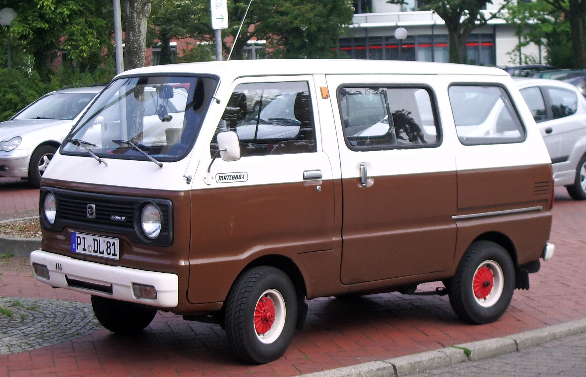
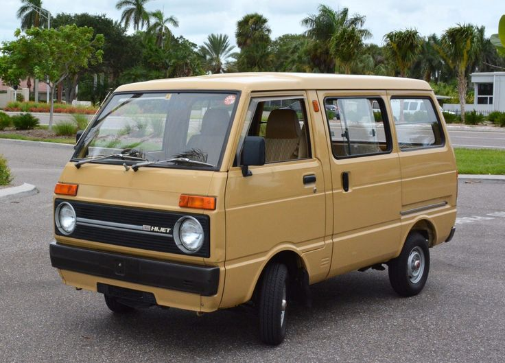
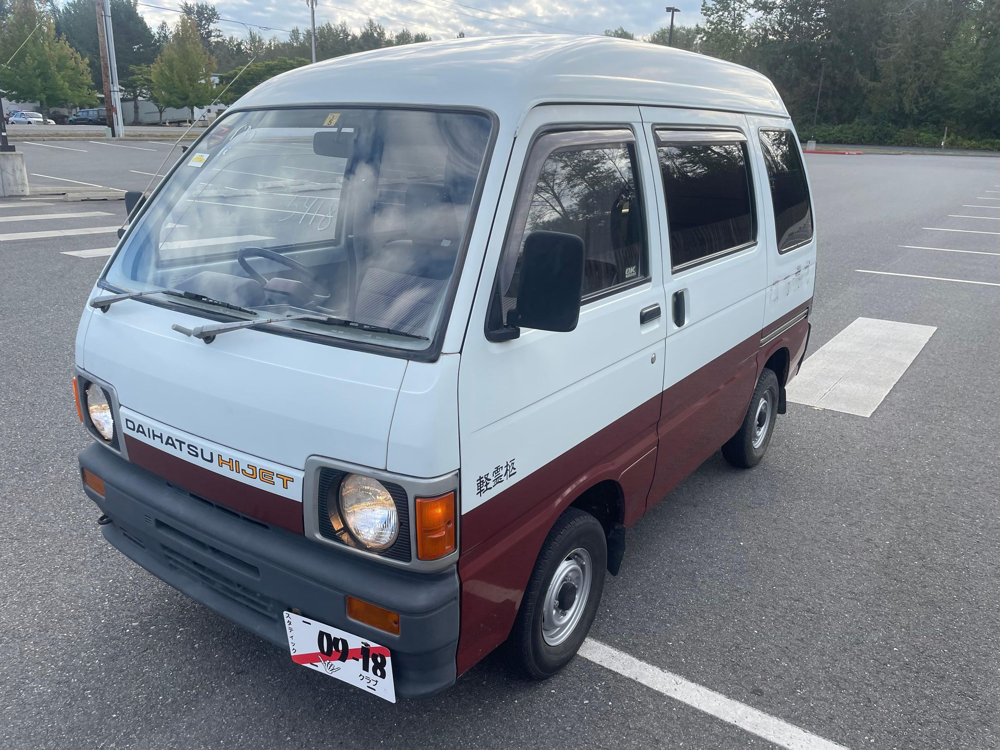
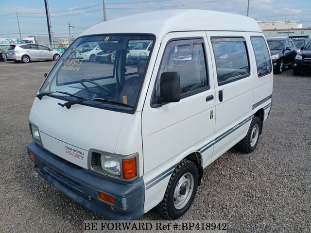
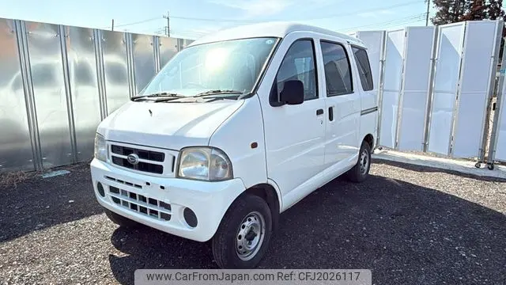
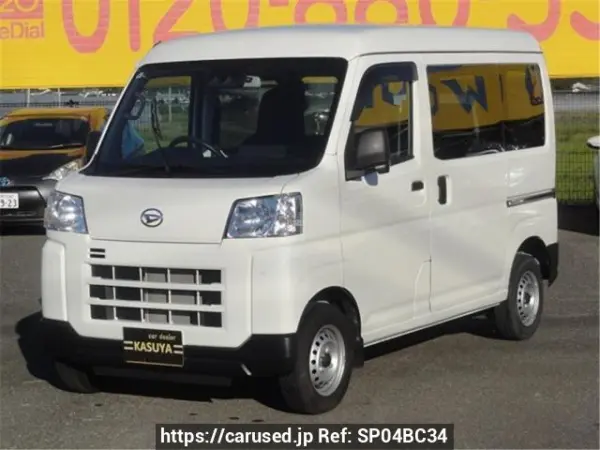

The Hijet Van was renamed Hijet Cargo in 1999, when it changed from cabover to semi-cabover. The passenger-focused Atrai became a separate model in 1994.

# 5th Generation

## S60V

* **Production:** 1977-1981
* **Engine:** AB 547cc SOHC I2, carburettor (28 PS)
* **Drivetrain:** RWD
* **Transmission:** 4-speed manual
* **Notes:** Sold as the Hijet 55 Wide Slide Van.

# 6th Generation

## S65V / S66V

* **Production:** 1981-1986
* **Engine:** AB 547cc SOHC I2, carburettor (29 PS)
* **Drivetrain:** RWD (S65V); selectable part-time 4WD (S66V, from 1982)
* **Transmission:** 4/5-speed manual
* **Notes:** High-roof bodies were offered, and the passenger-focused Atrai derivative joined.

# 7th Generation

## S80V / S81V - 550cc

* **Production:** 1986-1990
* **Engine:** EB 547cc SOHC I3, carburettor (30 PS)
* **Drivetrain:** RWD (S80V); selectable part-time 4WD (S81V)
* **Transmission:** 4/5-speed manual
* **Notes:** Air conditioning and front disc brakes were available. The Deck Van joined in 1989.

## S82V / S83V - 660cc

* **Production:** 1990-1994
* **Engine:** EF 659cc SOHC I3, carburettor (38-42 PS)
* **Drivetrain:** RWD (S82V); selectable part-time 4WD (S83V)
* **Transmission:** 4/5-speed manual
* **Notes:** Longer 660cc update; Deck Van and high-roof versions continued.

# 8th Generation

## S100V / S110V

* **Production:** 1994-1999
* **Engine:** EF-series 659cc SOHC/DOHC I3, carburettor (42-44 PS)
* **Drivetrain:** RWD (S100V); selectable part-time 4WD (S110V)
* **Transmission:** 5-speed manual
* **Notes:** Atrai became a separate model line. Front disc brakes were standard; air conditioning and power steering varied by grade.

# 9th Generation

## S200V / S210V

* **Production:** 1999-2004
* **Engine:** EF-series 659cc SOHC/DOHC I3, EFI (43-50 PS); turbo EF-DET (64 PS)
* **Drivetrain:** RWD (S200V); selectable part-time 4WD (S210V)
* **Transmission:** 5-speed manual
* **Notes:** Renamed Hijet Cargo and changed to a Giugiaro-designed semi-cabover body. Air conditioning, airbags and ABS varied by grade.

# 10th Generation

## S320V / S330V - EF engine

* **Production:** 2004-2007
* **Engine:** EF-VE 659cc DOHC 12-valve I3, EFI (50 PS); turbo EF-DET (64 PS)
* **Drivetrain:** RWD (S320V); selectable part-time 4WD (S330V)
* **Transmission:** 5-speed manual
* **Notes:** New long-wheelbase platform with a lower cargo floor and dashboard-mounted shifter. Air conditioning, dual airbags and ABS varied by grade.

## S321V / S331V - KF engine

* **Production:** 2007-2021
* **Engine:** KF-VE 658cc DOHC 12-valve I3, EFI (46-50 PS); turbo KF-DET (64 PS)
* **Drivetrain:** RWD (S321V); selectable part-time 4WD (S331V)
* **Transmission:** 5-speed manual
* **Notes:** The timing-chain KF engine replaced the EF. Smart Assist joined the range in 2017; manual turbo and Deck Van versions were available.

# 11th Generation

## S700V / S710V

* **Production:** 2021-present
* **Engine:** KF 658cc DOHC 12-valve I3, EFI (46 PS)
* **Drivetrain:** RWD (S700V); selectable part-time 4WD (S710V)
* **Transmission:** 5-speed manual
* **Notes:** DNGA-based redesign with a squarer cargo body. Front disc brakes, dual airbags, ABS and stability control are standard; Smart Assist is available. Deck Van models use S700W/S710W codes.
